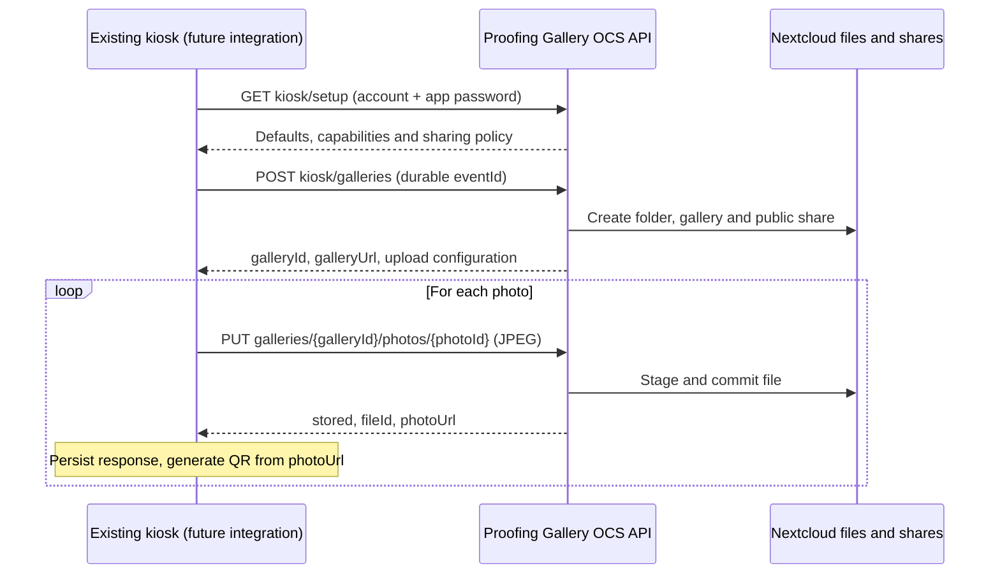

# Fotobox kiosk integration

Proofing Gallery provides an authenticated provisioning and JPEG upload API. The existing kiosk software is not changed by this feature; this document defines its future communication contract. The [OpenAPI specification](../api/kiosk-v1.yaml) describes the wire format.

## Create a gallery from the owner interface

Choose **New project → Fotobox**, enter an event title, select a writable parent folder and a starting design, then choose **Create and publish**. Optional access settings specify a gallery password and expiration date. Nextcloud can require either setting. The new empty gallery is immediately public and shows a waiting state. Copy its public link or copy/download the connection JSON for the kiosk integration. Account credentials and gallery passwords are not included in that JSON.

The API and this dialog run the same provisioning workflow. User preferences supply a default parent folder and design. Saved designs contribute presentation settings; the Fotobox workflow explicitly sets a shared standard delivery, direct folder listing, newest photos first, individual downloads where permitted, and disables guest uploads and collaboration. This is separate from the existing Event Delivery feature that distributes private recipient albums.

## Communication and architecture



Use HTTPS and a dedicated Nextcloud account with an app password. The account must own the created gallery and have a writable parent folder and permission to publish. Kiosk calls use HTTP Basic authentication, `OCS-APIRequest: true`, and `?format=json`. Browser calls use the current Nextcloud session. There is no separate upload secret and no unauthenticated upload API. Setup and upload do not grant guests write access.

All paths are relative to the Nextcloud installation root, including a deployment subdirectory if present:

| Method | OCS path | Purpose |
| --- | --- | --- |
| GET | `/ocs/v2.php/apps/proofing_gallery/api/v1/kiosk/setup` | Read defaults, capabilities, sharing policy and upload limits |
| POST | `/ocs/v2.php/apps/proofing_gallery/api/v1/kiosk/galleries` | Create folder, gallery and immediately usable public share |
| PUT | `/ocs/v2.php/apps/proofing_gallery/api/v1/kiosk/galleries/{galleryId}/photos/{photoId}` | Store one raw JPEG and return its photo-page URL |

Do not guess the upload URL: use the returned `upload.urlTemplate`, replacing the exact `upload.photoIdPlaceholder` (`PHOTO_ID`) with the durable UUID. The response's `galleryUrl` and `photoUrl` are absolute URLs generated by Nextcloud. Configure its external host/proxy URL correctly.

### Provisioning request and durable event identity

`eventId` is required, account-scoped, 1–128 URL-safe characters (`A-Z`, `a-z`, digits, `.`, `_`, `:`, `-`; first character alphanumeric). Persist it before the request. `title` is required, 1–255 characters after trimming. `parentFolderId` and `designPresetId` may be omitted or null to use owner preferences. `designPresetId: 0` selects the studio default; a positive ID selects an owned design. A writable parent folder is required. `password` defaults to an empty string; `expiresAt` defaults to an empty string and otherwise uses a future `YYYY-MM-DD` date. Nextcloud policy can impose a password, default expiration or maximum expiration.

The same account, event ID and normalized request parameters resume an incomplete setup or return the same ready gallery. Changed request parameters return 409. Defaults are frozen at the first successful reservation; changes to owner preferences do not create another gallery on replay. Preserve the original request, including optional field choices and password, for retries. Identity records remain until gallery purge or account removal; they have no 24-hour timeout. Use a new event ID for a new event. Revoked, expired, archived or differently scoped shares are not silently replaced on replay.

### Upload request and response

Use a stable UUID `photoId` for each captured/exported JPEG. Persist the ID and exact JPEG bytes locally before uploading. Send `Content-Type: image/jpeg` with raw bytes, without multipart encoding. V1 accepts JPEG only, validates the image format and enforces `maxBytes`. Photos are stored as `{photoId}.jpg` in the event folder. UUIDs are normalized to lowercase.

A successful first request returns HTTP 201. An identical replay returns HTTP 200 and the same file ID and URL. Different bytes for an existing photo ID return 409 and never overwrite the photo. A stored file left by an interrupted commit is recovered by deterministic filename and checksum. Uploads are serialized per gallery. The API returns success only after the file and receipt are stored and the current public link covers that photo. Preview generation can finish later.

An external file deletion or share change can invalidate a previous URL; an API error does not restore deleted media or resurrect revoked links. Keep original files and the kiosk's successful receipts according to the operator's retention settings.

OCS wraps JSON responses; read **`ocs.data`**, not top-level `photoUrl`:

```json
{
  "ocs": {
    "meta": { "status": "ok", "statuscode": 201, "message": "OK" },
    "data": {
      "photoId": "df53f798-29cf-4f6d-b18a-859a9c1f7632",
      "fileId": 12345,
      "status": "stored",
      "photoUrl": "https://cloud.example.test/s/SHARE_TOKEN?photo=12345",
      "replayed": false
    }
  }
}
```

The URL opens the gallery lightbox for that **Nextcloud file ID**. It is not a direct JPEG or download URL. Use `photoUrl` unchanged as the QR payload. A password-protected share still prompts guests for its password; the URL contains no password. All guests with access can browse the same gallery. A photo QR does not provide private per-photo access.

Visible Fotobox galleries refresh every five seconds without changing the active photo. Hidden tabs pause updates and refresh when visible again. Direct folder listing avoids waiting for the recursive index cron job. Under normal load, new photos should appear within ten seconds; background processing and network conditions can increase this time.

### Failures, retries and offline queue

| HTTP | Meaning | Kiosk behavior |
| --- | --- | --- |
| 200 / 201 | Successful replay / first stored result | Persist `ocs.data`, then generate QR |
| 401 | Authentication rejected | Correct account/app password |
| 403 | Policy or permission denied | Operator intervention |
| 404 | Owned gallery, file or share unavailable | Check event configuration |
| 409 | Event parameters/photo bytes conflict, or public link no longer usable | Reconcile state; do not overwrite or invent another photo ID for the same capture |
| 422 | Invalid parameters, MIME/size, sharing or password policy | Correct configuration or image |
| 423 | Gallery busy | Honor `Retry-After` (currently 1 second), retry same ID and bytes |
| 429 | 60 new uploads/minute per gallery | Honor `Retry-After` (currently 60 seconds), retain queue |
| Network / 5xx | Result uncertain | Retry original event request or original photo ID and bytes with backoff |

Successful photo replays do not consume the new-photo rate limit. Queued captures need durable local storage across kiosk restarts, bounded retries with backoff and visible queue/error state. Do not generate a success QR until an upload acknowledgement supplies `photoUrl`. Store acknowledgement and QR source together; never derive a URL from the local filename. No kiosk executable or source change is supplied here.

## Curl examples

Set `NEXTCLOUD_URL`, `NEXTCLOUD_USER` and `NEXTCLOUD_APP_PASSWORD` in your own environment. These examples require curl and jq. Save the request JSON and event ID before making the provisioning call.

```bash
curl --fail-with-body --user "$NEXTCLOUD_USER:$NEXTCLOUD_APP_PASSWORD" \
  -H 'OCS-APIRequest: true' \
  "$NEXTCLOUD_URL/ocs/v2.php/apps/proofing_gallery/api/v1/kiosk/setup?format=json"

# Use the parent folder ID from setup, or supply another writable folder ID.
cat > event-request.json <<'JSON'
{"eventId":"event-2026-10-01-001","title":"Autumn event","parentFolderId":123}
JSON
curl --fail-with-body --user "$NEXTCLOUD_USER:$NEXTCLOUD_APP_PASSWORD" \
  -H 'OCS-APIRequest: true' -H 'Content-Type: application/json' \
  --data-binary @event-request.json \
  "$NEXTCLOUD_URL/ocs/v2.php/apps/proofing_gallery/api/v1/kiosk/galleries?format=json" \
  --output event-response.json
jq '.ocs.data' event-response.json > connection.json

# Persist this UUID together with the original JPEG before the first request.
PHOTO_ID='df53f798-29cf-4f6d-b18a-859a9c1f7632'
UPLOAD_URL=$(jq -r --arg id "$PHOTO_ID" '.upload.urlTemplate | sub("PHOTO_ID"; $id)' connection.json)
curl --fail-with-body --user "$NEXTCLOUD_USER:$NEXTCLOUD_APP_PASSWORD" \
  -H 'OCS-APIRequest: true' -H 'Content-Type: image/jpeg' \
  -X PUT --data-binary @photo.jpg "$UPLOAD_URL" --output photo-response.json
jq -r '.ocs.data.photoUrl' photo-response.json
```

## Storage and lifecycle

A compatible migration adds account/event mappings and upload receipts with unique identities. Per-event and per-gallery locks prevent concurrent duplicates. Provisioning saves its folder mapping and commits gallery/public-link mappings transactionally; uploads stage and commit in Nextcloud storage, then persist the receipt. A retry resumes those boundaries. The stored configuration contains no gallery/app password; the request fingerprint is an HMAC-SHA-256 digest keyed by the Nextcloud instance secret and is excluded from privacy export. Privacy export/purge includes kiosk records. Files follow the existing gallery/files lifecycle. Permanently purging a gallery removes its kiosk identity, so clients must not continue replaying that deleted event.
